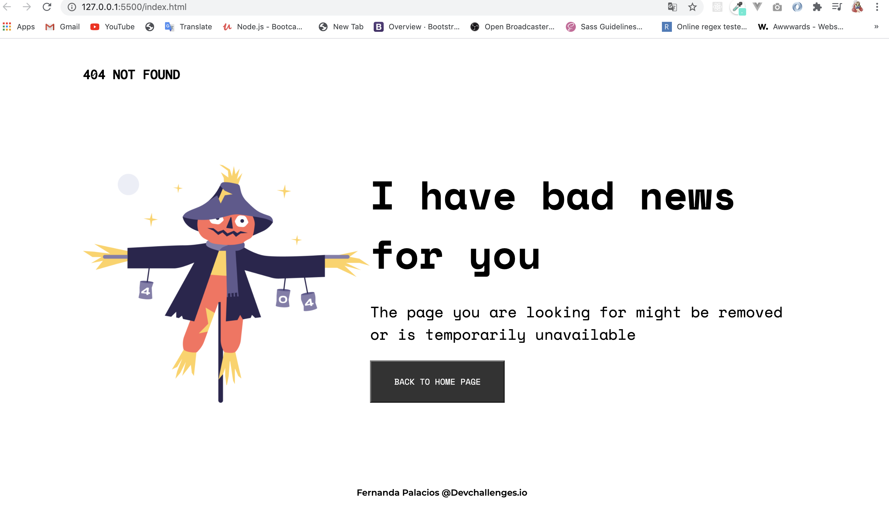

<!-- Please update value in the {}  -->

<h1 align="center">Page 404 Not Found</h1>

   Solution for a challenge from  <a href="http://devchallenges.io" target="_blank">Devchallenges.io</a>.

  <h3>
    <a href="https://page-404-not-found.vercel.app/">
      Demo
    </a>
     | 
    <a href="https://github.com/EveFer/page_404_Not_Found">
      Solution
    </a>
     | 
    <a href="https://github.com/EveFer/page_404_Not_Found">
      Challenge
    </a>
  </h3>

<!-- TABLE OF CONTENTS -->

## Table of Contents

- [Overview](#overview)
  - [Built With](#built-with)
- [Features](#features)
- [How to use](#how-to-use)
- [Contact](#contact)

<!-- OVERVIEW -->

## Overview

This a Challenge where i builded with **HTML** and **CSS3**, I implemented **mobile First** to
design responsive.
This challenge is deployed on [Vercel](https://vercel.com/) 

### Built With

<!-- This section should list any major frameworks that you built your project using. Here are a few examples.-->

- HTML
- CSS3

## Features

- [x] User story: This is a completed user stories

## Contact

- GitHub [@EveFer](https://{github.com/EveFer})
